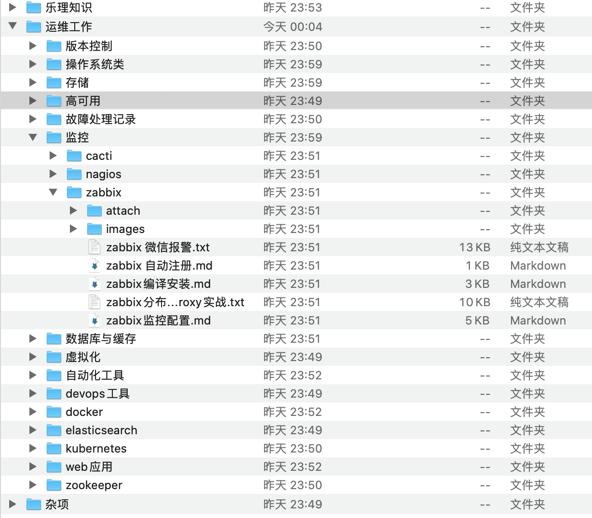

# Leanote Export to Markdown

```
由于之前用是 leanote 蚂蚁笔记私服，现在想转到思源笔记
发现 leanote 没有导成markdown的方法。。
只好自己手动操作了。。
无限目录树结构、链接替换、附件下载
```

### 编译

```shell script
go build -mod=vendor
```

### 使用方法：

```
./leanote-2-md
Leanote 网址[default: https://leanote.com]：
UserName: admin
password: xxxxxx
ggangelo xxxxxx
登陆成功 admin(admin@leanote.com)!
保存到[default(.)]: ~/Downloads/ouput
bye bye! admin
```

#### 导出效果图：



## 附带一个导入 wiz 笔记的 python 脚本

环境： python 3.7 以上
库： requests, requests_toolbelt

```
pip install requests requests_toolbelt
```

具体使用方法请查看 wiz.py

```python
if __name__ == '__main__':
```
